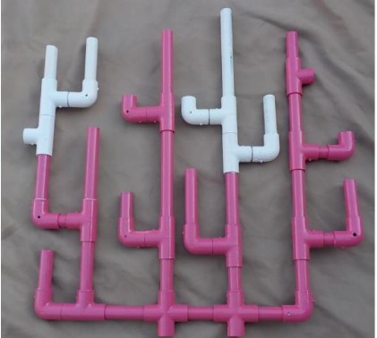
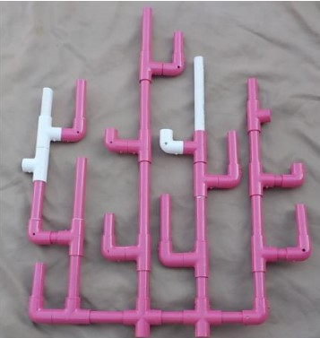
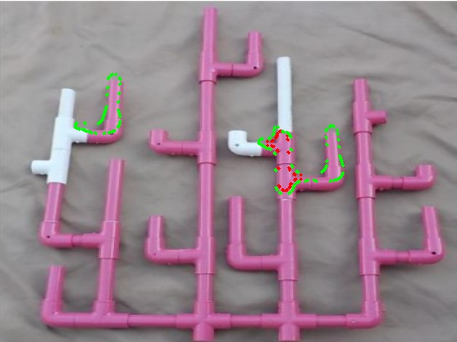
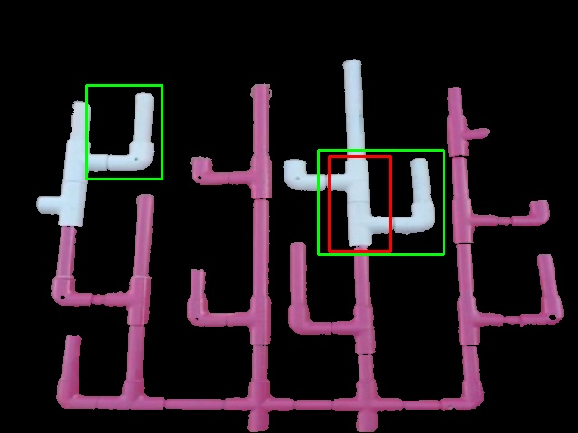

# CoralHealth-ML-Detection

## Project Goal
### Using Traditional Image Recognition to Determine the Health of a Coral Colony

This project was originally developed for the **MATE Egypt Regional ROV Competition 2021** and is designed to assess the health of a coral colony by comparing its current condition to past data. Visual indicators are used to detect areas of growth, damage, bleaching, and recovery, helping researchers and conservationists monitor coral health effectively.

## Health Indicators
The project utilizes color-coded rectangles to highlight specific health conditions of the coral:
- **Areas of Growth**: Marked with a green rectangle around the affected area.
- **Areas of Damage or Death**: Marked with a yellow rectangle around the affected area.
- **Areas of Bleaching/Blotching**: Marked with a red rectangle around the affected area.
- **Areas that Have Recovered from Bleaching/Blotching**: Marked with a blue rectangle around the affected area.

## Approach
This project applies traditional image recognition techniques using **OpenCV**. With six months dedicated to learning and implementing CV2, I was able to tune parameters manually to achieve effective detection, using only the **NumPy**, **Matplotlib**, and **CV2** libraries. Trackbars allow real-time control of detection parameters without the need for training any machine learning models.

The success of this project inspired my journey into **Machine Learning (ML)**, **Deep Learning (DL)**, and **Reinforcement Learning (RL)**, which I am now actively studying to enhance my skills and explore learnable techniques for future projects.

## Features
- **Manual Tuning with Trackbars**: Adjust parameters in real time for different health condition detections.
- **Automated Health Classification**: Automatically detects and classifies coral health conditions based on image data comparisons.
- **Traditional Computer Vision**: Applies thresholding and color-based recognition without trained parameters, using OpenCV's powerful processing tools.

## Technologies
- **Python**
- **NumPy** for numerical operations
- **Matplotlib** for visualization
- **OpenCV (CV2)** for image processing


## Results

In this section, we present the results of the coral health assessment obtained from the **CoralHealth-ImageAnalysis-and-Detection** project. The following images illustrate the coral images taken during the project, along with reference and result images.

### Sample Images Taken

1. **Taken Image**
   

### Reference Image

**Reference Coral Image**


### Result Images

1. **Result Images**
   
   

### Summary of Results

The results demonstrate the capability of the system to accurately assess coral health, highlighting various conditions. Further refinements using machine learning techniques could enhance detection accuracy and robustness.


## Getting Started
1. Clone the repository:
   ```bash
   git clone https://github.com/yourusername/CoralHealth-ML-Detection.git

2. Install required packages:
   ```bash
   pip install numpy matplotlib opencv-python

3. Open **coral_detection.ipynb** in Jupyter Notebook and follow the instructions to use the trackbars and view results.

## Usage
- **Adjust Parameters**: Use trackbars to manually tune and detect various coral health conditions.
- **Visualization**: Color-coded rectangles are used to mark areas in coral images, indicating different health conditions based on image data.

## Future Work
- **Explore Learnable Techniques**: Building upon this project, I am now studying ML, DL, and RL to incorporate learnable techniques for enhanced detection performance.
- **Real-Time Monitoring**: Aiming for a real-time monitoring application that can operate with live video or continuous data input.
